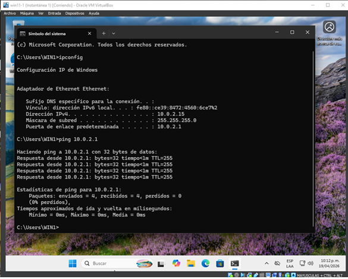
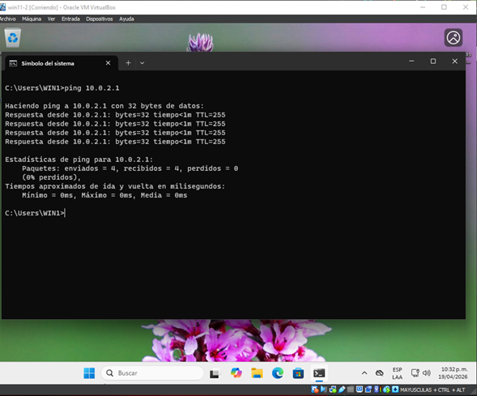
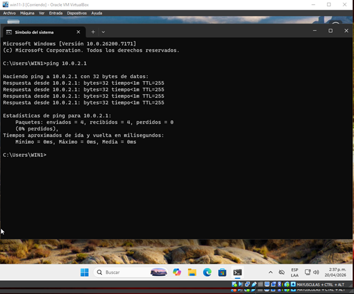
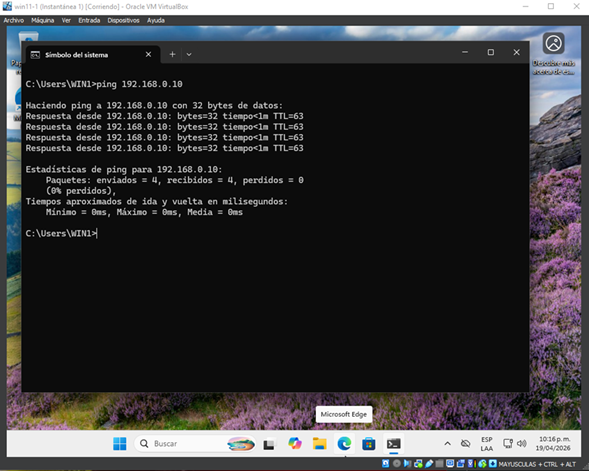
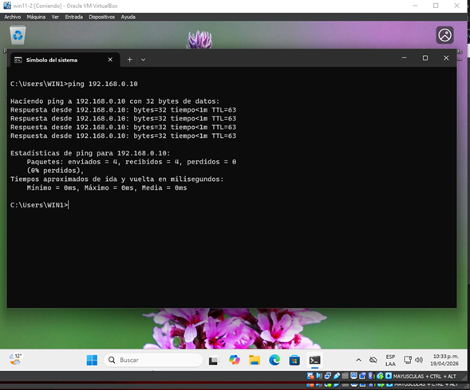
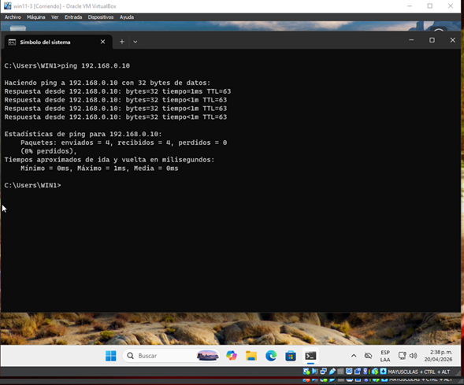
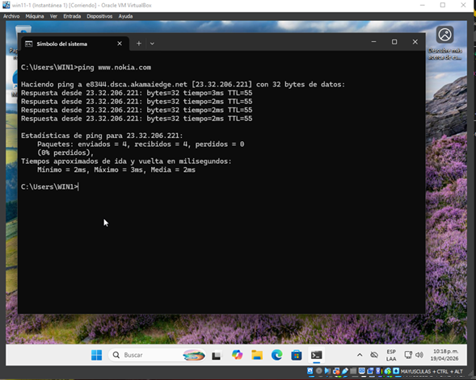
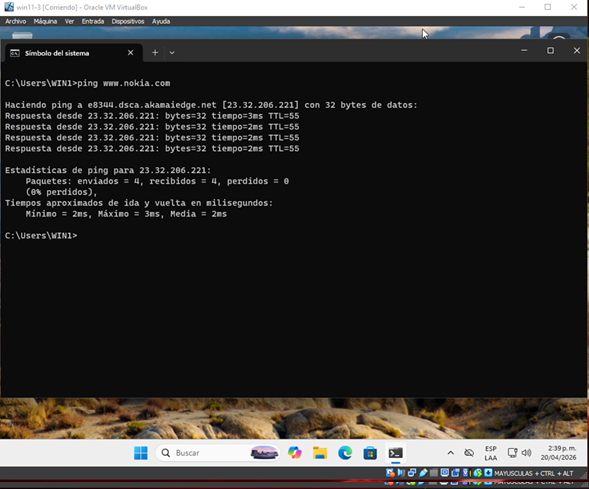

## Condiciones de la prueba

- **# de prueba:** T1
- **Condiciones:** Verificación de conectividad completa
- **Camino activado:** Conexión de todos los nodos de la red a internet
- **Secuencia de entradas:** En cada máquina de la LAN interna, hacer ping al: gateway (10.0.2.1), la interfaz northbound (192.168.0.10) y un dominio en internet (nokia.com)
- **Salidas esperadas:** Respuesta desde los diferentes hosts

## Salidas obtenidas

### T1.1 - Ping al Gateway (10.0.2.1)

| Máquina | Evidencia | Resultado |
|:--------|:----------|:----------|
| PC-Win11-1 (W1) |  | ✅ Exitosa |
| PC-Win11-2 (W2) |  | ✅ Exitosa |
| PC-Win11-3 (W3) |  | ✅ Exitosa |

### T1.2 - Ping a Interfaz Northbound (192.168.0.10)

| Máquina | Evidencia | Resultado |
|:--------|:----------|:----------|
| PC-Win11-1 (W1) |  | ✅ Exitosa |
| PC-Win11-2 (W2) |  | ✅ Exitosa |
| PC-Win11-3 (W3) |  | ✅ Exitosa |

### T1.3 - Ping a dominio público (nokia.com)

| Máquina | Evidencia | Resultado |
|:--------|:----------|:----------|
| PC-Win11-1 (W1) |  | ✅ Exitosa |
| PC-Win11-2 (W2) |  | ✅ Exitosa |
| PC-Win11-3 (W3) |  | ✅ Exitosa |

## Observación

Se logró la conectividad completa desde todas las máquinas de la LAN interna hacia el gateway (10.0.2.1), la interfaz northbound (192.168.0.10) y el dominio externo nokia.com, con respuestas exitosas en todos los casos. El tiempo de respuesta fue menor a 1ms para destinos locales y variable para internet.