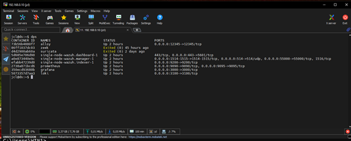
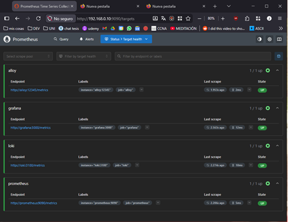

## Condiciones de la prueba

- **# de prueba:** T2
- **Condiciones:** Verificar que los servicios del stack GALP (Grafana, Loki, Prometheus, Alloy) están desplegados y en ejecución dentro del entorno Docker.
- **Camino activado:** Desde el navegador hasta los contenedores del stack GALP
- **Secuencia de entradas:** En la VM llamada ds ejecutar el comando `docker ps` para ver los contenedores activos
- **Salidas esperadas:** Tabla compuesta por ID, NOMBRE, STATUS y PUERTOS con los 4 contenedores

## Salidas obtenidas

### T2 - Contenedores Docker activos

### T2.1 - Verificación de servicios vía navegador

**Condición:** Verificar que los servicios del stack GALP estén vivos y arriba  
**Ruta:** Desde el host, navegador a `http://192.168.0.10:9090/targets`

## Observación

Los cuatro servicios (Grafana, Loki, Prometheus, Alloy) se encuentran desplegados y en estado **"UP"** según la interfaz de targets de Prometheus. La tabla `docker ps` confirma que los contenedores están en ejecución con sus puertos correctamente mapeados.