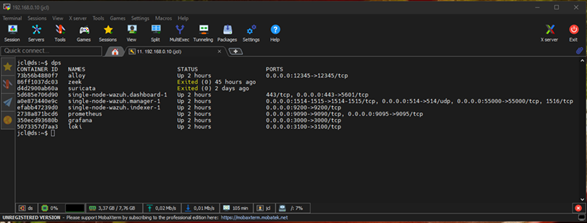
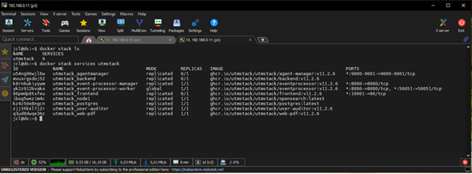
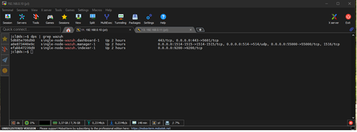

## Condiciones de la prueba

- **# de prueba:** T3
- **Condiciones:** Verificar que Suricata, Zeek, UTMStack y Wazuh estén activos
- **Camino activado:** Desde los contenedores de IDS/IPS hasta el host
- **Secuencia de entradas:** 
  1. Desplegar Zeek y Suricata en ds
  2. Ejecutar el comando `docker ps` en ds
  3. Ejecutar `docker stack ls` y `docker ps` para UTMStack
  4. Desplegar Wazuh en ds y ejecutar `docker ps`
- **Salidas esperadas:** Tablas con ID, NOMBRE, STATUS y PUERTOS de los contenedores

## Salidas obtenidas

### T3 - Contenedores Suricata y Zeek

### T3.1 - Servicios UTMStack

### T3.2 - Servicios Wazuh

## Observación

Los servicios de IDS/IPS (Suricata, Zeek, UTMStack y Wazuh) se encuentran desplegados y en ejecución según la salida del comando `docker ps`. Cada servicio muestra estado **Up** y sus puertos correspondientes expuestos.