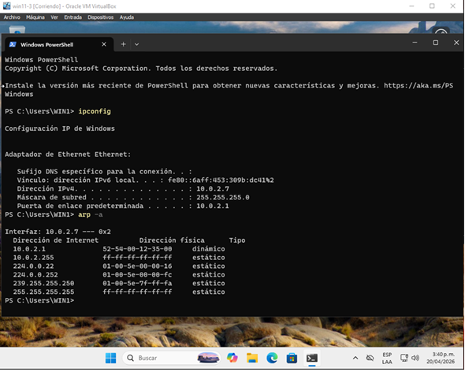
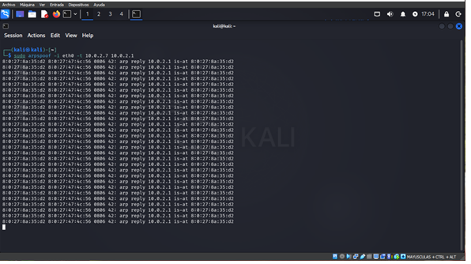
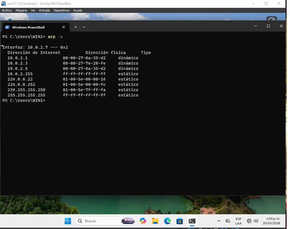

## Condiciones de la prueba

- **# de prueba:** T4
- **Condiciones:** ARP Spoofing - Víctima (L2) → Atacante (MAC Spoofing) → Gateway
- **Camino activado:** Víctima → Atacante → Gateway
- **Secuencia de entradas:** 
  1. Ejecutar `arp -a` en la Víctima para registrar la MAC legítima del Gateway
  2. Ejecutar comando de envenenamiento en el Atacante: `arpspoof -i eth0 -t [IP_Victima] [IP_Gateway]`
  3. Ejecutar nuevamente `arp -a` en la Víctima
  4. Revisar en el dashboard
- **Salidas esperadas:** 
  1. La tabla ARP de la Víctima asocia la IP del Gateway con la dirección MAC del Atacante
  2. El tráfico de la Víctima hacia internet sigue fluyendo pero transita por el nodo Atacante

## Salidas obtenidas

### Paso 1: Tabla ARP inicial (MAC legítima del Gateway)

### Paso 2: Ejecución del ataque arpspoof en el Atacante

### Paso 3: Tabla ARP después del envenenamiento

## Observación

Se logró evidenciar el envenenamiento ARP exitoso. La tabla ARP de la víctima ahora asocia la IP del Gateway (10.0.2.1) con la dirección MAC del atacante, demostrando la vulnerabilidad al ARP Spoofing en el ambiente. El atacante logra interceptar el tráfico de la víctima.