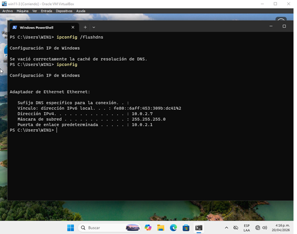
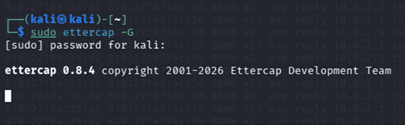
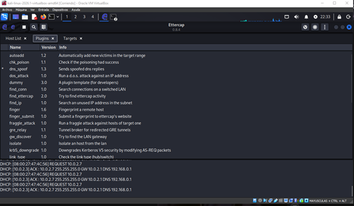
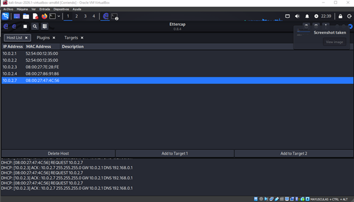
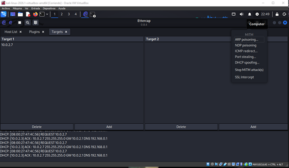
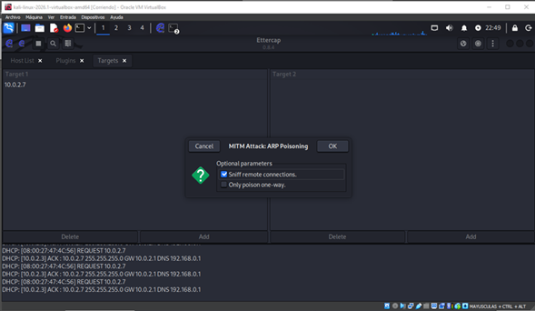
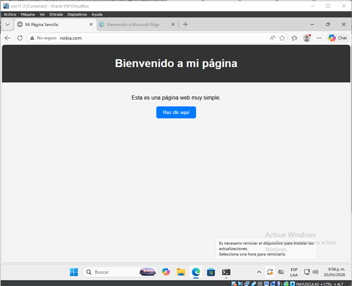

## Condiciones de la prueba

- **# de prueba:** T5
- **Condiciones:** DNS Spoofing - Víctima → Atacante (Intercepción DNS) → IP Atacante (Sitio Falso)
- **Camino activado:** Víctima → Atacante → Sitio Falso
- **Secuencia de entradas:**
  1. En la Víctima, limpiar caché DNS (`ipconfig /flushdns`)
  2. En el Atacante, iniciar el servicio de spoofing DNS (`sudo ettercap -G`)
  3. En la Víctima, intentar acceder vía navegador web a nokia.com
- **Salidas esperadas:**
  1. El comando nslookup devuelve la IP del Atacante para el dominio consultado
  2. El navegador de la Víctima despliega el contenido alojado en el servidor web del Atacante

## Salidas obtenidas

### Paso 1: Limpiar caché DNS en la Víctima

### Paso 2: Iniciar Ettercap en el Atacante

### Paso 3: Habilitar plugin DNS Spoofing en Ettercap

### Paso 4: Escaneo de red y selección de host víctima

### Paso 5: Activar ARP Spoofing desde menú MITM

### Paso 6: Ataque en curso

### Paso 7: Víctima intenta acceder a nokia.com

## Observación

Se logró ejecutar exitosamente el ataque de DNS Spoofing. La víctima al intentar acceder a nokia.com es redirigida al sitio falso alojado en el atacante, demostrando la intercepción DNS en el ambiente. El plugin de DNS spoofing de Ettercap permitió redirigir el tráfico exitosamente.